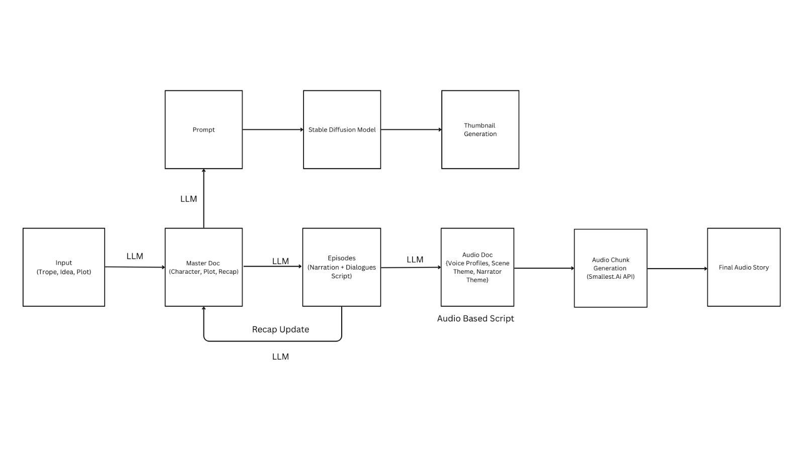

# 🎧 AutoStory: AI-Powered Audio Storytelling Engine

Welcome to **AutoStory**, an end-to-end AI-driven pipeline that transforms a simple idea into an immersive audio experience — complete with plot, character-driven narration, and visually rich thumbnails. Developed during the **KukuFM Hackathon** by **Team TeanRusk - (Ayush Mothiya, Sudhanshu Kumar, Haribhajan)**, this project automates the storytelling process from input to final audio output.

---

## 🚀 Overview

This system automates:

- 📜 Story and episode script generation (Calliope)
- 🎨 Thumbnail creation using multi-model image generation (Iris)
- 🗣️ Studio-quality audio narration with character-voice mapping (Echo)

All pipelines are modular, efficient, and designed for quality and scalability.

---

## 🧐 Architecture




---

## 🧹 Subsystems

### 📜 Calliope – The Story Generator
- **Input:** Trope, Genre, Episode count, Time per episode
- **Output:** Title, Plot, Characters, Recap, Episode Scripts
- **Model:** `OpenAI o1` (chosen for deep story understanding and coherent arcs)

### 🎨 Iris – The Designer
- Thumbnail prompts generated using `GPT-4o`
- Free image previews via `Gemini API`
- Final high-res image via `Imagen 3` (Google)

### 🗣️ Echo – The Voice Artist
- TTS by `Smallest.AI`
- Custom voice mapping based on accent, gender, age, and persona
- Audio chunks stitched into final episodic stories

---

## ⚙️ Technologies Used

| Category         | Tools/Models Used                              |
|------------------|------------------------------------------------|
| LLMs             | OpenAI o1, GPT-4o                              |
| TTS              | Smallest.AI                                    |
| Image Gen        | Google Gemini API, Imagen 3                    |
| Prompt Handling  | Python, Custom Heuristics                      |
| Voice Matching   | Custom scoring system                          |
| Output Formats   | `.wav` for audio, `.jpg` for thumbnails, `.pdf` for scripts |

---

## 📂 Repository Structure

```
├── Calliope/             # Script generation pipeline
│   └── story_generator.py
├── Iris/                 # Thumbnail generation pipeline
│   └── thumbnail_pipeline.py
├── Echo/                 # Audio synthesis pipeline
│   └── audio_pipeline.py
├── data/                 # Master docs, scripts, audio chunks
│   ├── master_doc.json
│   └── episodes/
├── .env                  # API Keys
├── README.md
├── requirements.txt
└── main.py               # Orchestrator script
```

---

## 🧪 Running the Project

> 📝 Requires API keys for OpenAI, Smallest.AI, Gemini, and Imagen 3.

```bash
# Clone the repo
git clone https://github.com/<your-username>/AutoStory-AI.git
cd AutoStory-AI

# Install dependencies
pip install -r requirements.txt

# Set up environment variables in .env
OPENAI_API_KEY=your_key_here
SMALLEST_API_KEY=your_key_here
GEMINI_API_KEY=your_key_here
IMAGEN3_API_KEY=your_key_here

# Run pipeline (example entry)
python main.py --idea "a sci-fi story about time-travelers who manipulate memories" --episodes 5 --genre "Sci-Fi"
```

---

## 📦 Output

- 🎧 Downloadable high-quality episode audios
- 🖼️ Custom-designed story thumbnails
- 📄 Episode scripts in PDF format

---

## 🧑‍💻 Team TeanRusk

- Sudhanshu Kumar (Developed Story Generation Pipeline)
- Ayush Mothiya (Image Generation Pipeline)
- Haribhajan Kushwaha (Backend & Voice Automation)

---

## 📌 Future Improvements

- Background music & sound effects layer
- Cloud deployment with queueing & async processing
- Creator dashboard for user uploads and management

---

## 📄 License

MIT License

---

## 🔐 .env Template

```dotenv
# OpenAI API for GPT-4o and o1
OPENAI_API_KEY=your_openai_api_key_here

# Smallest.AI TTS API
SMALLEST_API_KEY=your_smallest_api_key_here

# Gemini API key for thumbnail previews
GEMINI_API_KEY=your_gemini_api_key_here

# Imagen 3 API key for high-quality thumbnail
IMAGEN3_API_KEY=your_imagen3_api_key_here
```

---

## 📃 requirements.txt

```txt
openai>=1.0.0
python-dotenv>=1.0.0
requests>=2.31.0
pydub>=0.25.1
langdetect>=1.0.9
indic-transliteration>=2.3.44
smallest==1.2.0  # hypothetical, if pip-installable
tqdm>=4.66.1
